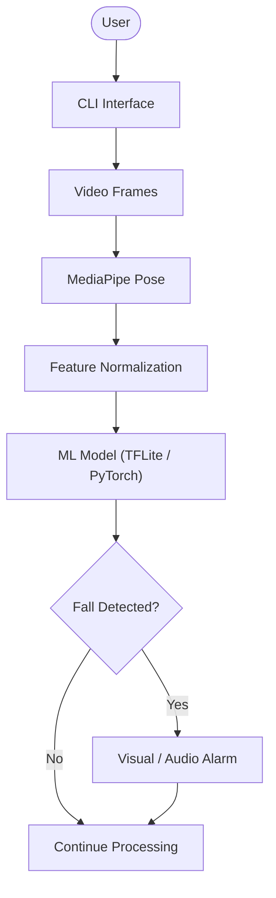
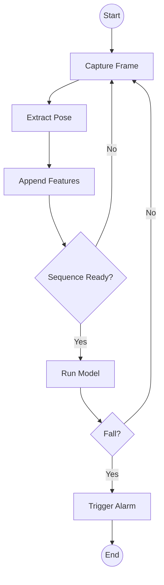
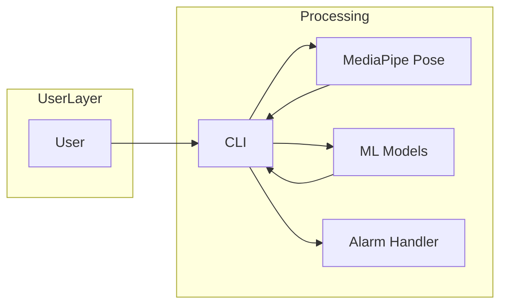
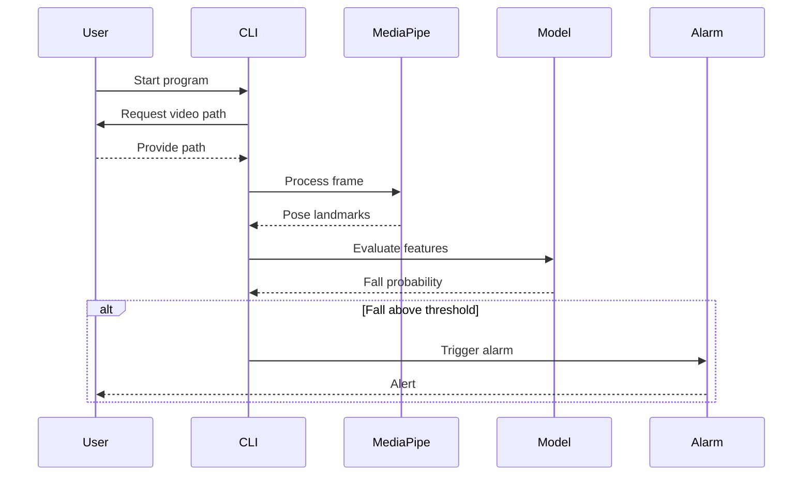
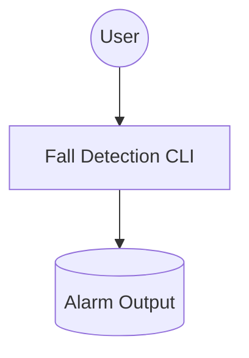
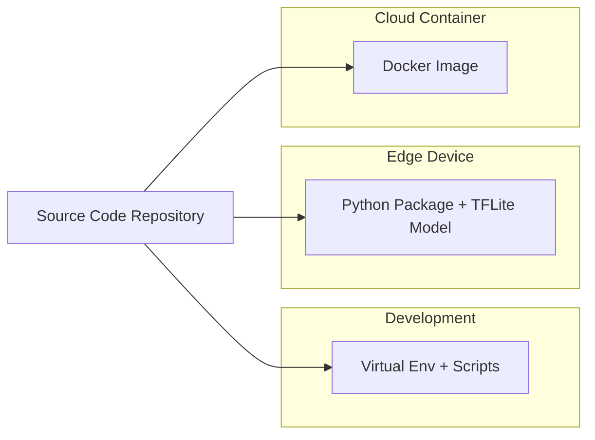
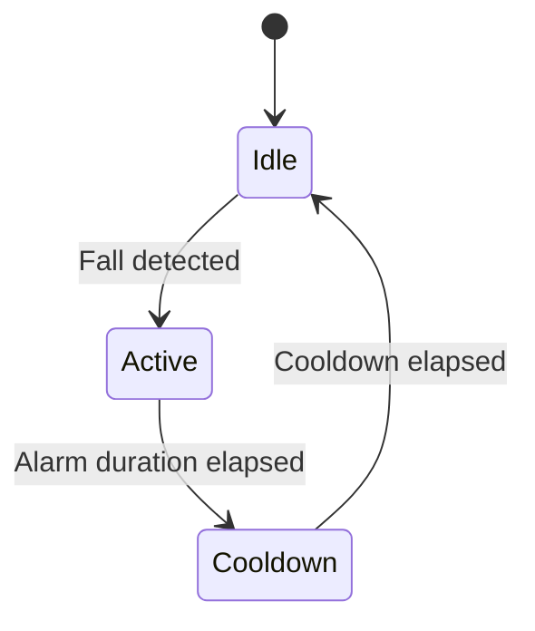
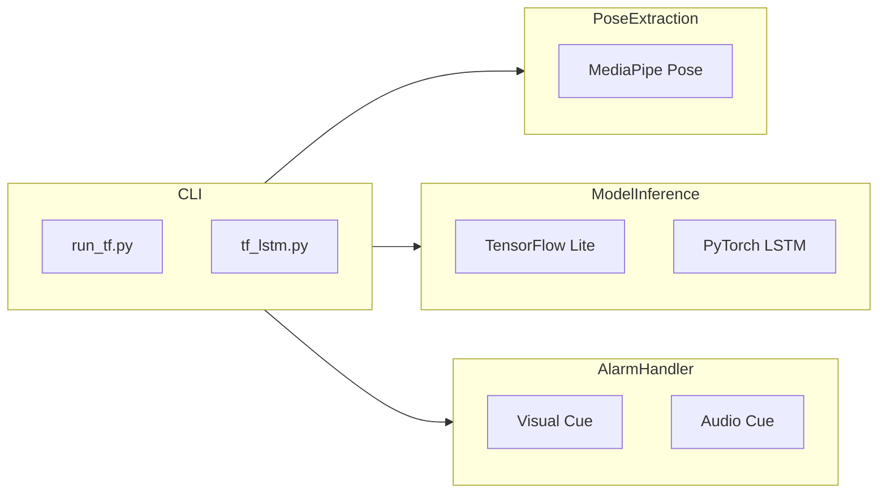

# Project Diagrams

## Index
- [Data Flow Diagram](#data-flow-diagram)
- [BPMN 2.0 Diagram](#bpmn-20-diagram)
- [Architectural Diagram](#architectural-diagram)
- [Sequence Diagram](#sequence-diagram)
- [Use Case Diagram](#use-case-diagram)
- [Entity Relationship Diagram](#entity-relationship-diagram)
- [Deployment Diagram](#deployment-diagram)
- [State Diagram](#state-diagram)
- [Component Diagram](#component-diagram)
- [Additional Diagram Suggestions](#additional-diagram-suggestions)

## Data Flow Diagram

The data flow diagram outlines how information traverses the fall detection pipeline. A user supplies a video stream via the command-line interface (CLI), which dispatches each frame to the MediaPipe Pose module for extraction of body landmarks. These landmarks undergo feature normalization to ensure consistent input values regardless of the original video scale. The normalized features are then delivered to the selected machine learning model, either a TensorFlow Lite transformer or a PyTorch LSTM, which evaluates whether the sequence of poses indicates a fall. Positive detections route the flow to the audio or visual alarm, while negative results return control to the processing loop to handle the next frame. This depiction highlights the system's cyclical operation, enabling continuous monitoring without manual resets.

## BPMN 2.0 Diagram

The BPMN diagram offers a process-centric perspective of the application. It begins with a start event that leads to frame capture and pose extraction. Extracted features are appended to a growing sequence until the required number of frames is accumulated. Once the sequence is ready, the model evaluates it to determine if a fall has occurred. A negative outcome loops the workflow back to capture the next frame, demonstrating continuous operation. A positive outcome triggers the alarm activity and proceeds to an end event, encapsulating one complete iteration of the detection process.

## Architectural Diagram

The architectural diagram depicts the structural composition of the system. A distinct user layer contains the human operator, who interacts solely with the CLI. Within the processing layer, the CLI acts as an orchestrator, coordinating with MediaPipe Pose for landmark extraction, invoking the machine learning models for inference, and delegating alert generation to the alarm handler. Bidirectional arrows indicate data and control exchanges, with the CLI serving as the central hub. This modular layout clarifies how responsibilities are divided, enabling components to be replaced or extended with minimal impact on the rest of the system.

## Sequence Diagram

The sequence diagram details the runtime interaction between system participants. The user initiates the program, prompting the CLI to request a video path. For each frame, the CLI calls MediaPipe to compute pose landmarks and passes the resulting features to the model. The model responds with a fall probability that the CLI compares to a predefined threshold. When the probability exceeds the threshold, the CLI sends a message to the alarm component, which ultimately alerts the user. This timeline representation clarifies the order of events and emphasizes the conditional branch that only engages the alarm on suspected falls.

## Use Case Diagram

The use case diagram presents a simplified overview of external interactions. It identifies the user as the sole actor who engages with the fall detection CLI. In response, the system produces an alarm output, representing its primary service. Although minimalistic, this depiction underscores that the application is designed for direct human operation and focuses on real-time alerting rather than long-term data management.

## Entity Relationship Diagram
The system operates entirely in memory and does not maintain persistent storage, so an entity relationship diagram would add little value. No discrete data entities or relationships are created or stored; incoming frames and derived features are processed transiently and discarded after inference. Consequently, traditional database modeling concepts are not applicable to this project.

## Deployment Diagram

The deployment diagram illustrates how the project can be packaged for multiple targets. Developers run the raw source within a virtual environment, enabling rapid iteration. For edge devices such as a Raspberry Pi, the code and TFLite model are bundled as a lightweight Python package. A Docker image encapsulates the same source for cloud or server deployments, ensuring consistent dependencies across platforms.

## State Diagram

The state diagram captures alarm behavior. The system idles until a fall is detected, at which point it enters an active state and raises an alarm. After the alarm plays for the configured duration, the application transitions into a cooldown state that suppresses additional alerts. Once the cooldown timer expires, the system returns to idle, ready to detect subsequent falls.

## Component Diagram

The component diagram defines the primary module boundaries. The CLI layer houses the executable scripts. Pose extraction is delegated to MediaPipe, while model inference is handled by either TensorFlow Lite or PyTorch. The alarm handler emits visual or audio cues. Each module communicates through the CLI, clarifying responsibilities and minimizing cross-dependencies.
