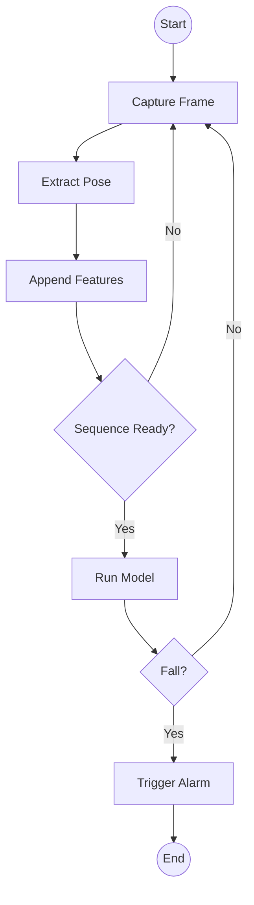
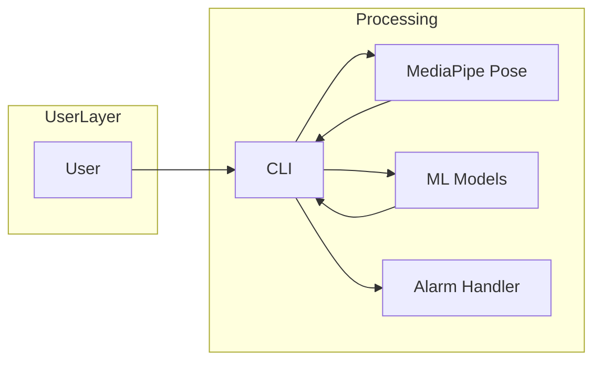
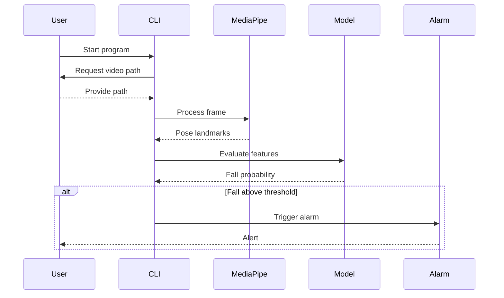
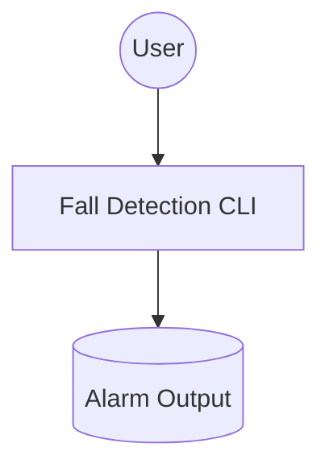

# Project Diagrams

## Index
- [Data Flow Diagram](#data-flow-diagram)
- [BPMN 2.0 Diagram](#bpmn-20-diagram)
- [Architectural Diagram](#architectural-diagram)
- [Sequence Diagram](#sequence-diagram)
- [Use Case Diagram](#use-case-diagram)
- [Entity Relationship Diagram](#entity-relationship-diagram)
- [Additional Diagram Suggestions](#additional-diagram-suggestions)

## Data Flow Diagram
```mermaid
flowchart TD
    User([User]) --> CLI[CLI Interface]
    CLI --> Video[Video Frames]
    Video --> Pose[MediaPipe Pose]
    Pose --> Normalize[Feature Normalization]
    Normalize --> Model[ML Model (TFLite/PyTorch)]
    Model --> Decision{Fall Detected?}
    Decision -->|Yes| Alarm[Visual/Audio Alarm]
    Decision -->|No| Loop[Continue Processing]
    Alarm --> Loop
```

## BPMN 2.0 Diagram


## Architectural Diagram


## Sequence Diagram


## Use Case Diagram


## Entity Relationship Diagram
The system does not persist data, so no entity relationship diagram is required.

## Additional Diagram Suggestions
- Deployment diagram showing packaging for different environments
- State diagram for alarm activation and cooldown
- Component diagram outlining module boundaries
